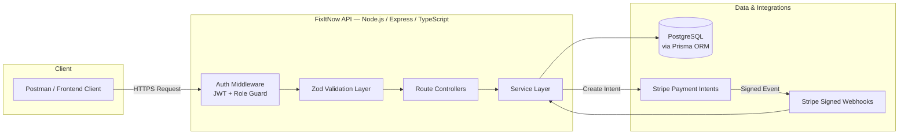

<div align="center">

# 🔧 FixItNow — Backend API

**A production-ready, role-based home service marketplace backend**

[](https://nodejs.org/)
[](https://expressjs.com/)
[](https://www.typescriptlang.org/)
[](https://www.postgresql.org/)
[](https://www.prisma.io/)
[](https://stripe.com/)
[](https://render.com/)
[](#license)

[Live API](#live-api-base-url) · [Postman Collection](#api-documentation) · [Endpoints](#api-endpoints) · [Local Setup](#local-installation)

</div>


---

FixItNow is a production-ready, role-based home service marketplace backend built with **Node.js, Express, TypeScript, PostgreSQL, Prisma, JWT, Zod, and Stripe**. The platform connects **Customers** with **Technicians**, while giving **Administrators** secure tools for managing users, categories, bookings, and payments.

The project ships with complete REST API documentation, server-side validation, structured JSON error handling, role-based authorization, real Stripe Payment Intent processing, signed Stripe webhook verification, deployment on Render, and a production PostgreSQL database.

## Table of Contents

- [Live Links and Submission Information](#live-links-and-submission-information)
- [Admin Credentials](#admin-credentials)
- [Project Overview](#project-overview)
- [System Architecture](#system-architecture)
- [Mandatory Assignment Requirements](#mandatory-assignment-requirements)
- [Core Features](#core-features)
- [Technology Stack](#technology-stack)
- [Live API Base URL](#live-api-base-url)
- [API Documentation](#api-documentation)
- [API Endpoints](#api-endpoints)
- [API Response Format](#api-response-format)
- [HTTP Status Codes](#http-status-codes)
- [Local Installation](#local-installation)
- [Database Setup](#database-setup)
- [Run the Project](#run-the-project)
- [Stripe Webhook Testing](#stripe-webhook-testing)
- [Render Deployment Configuration](#render-deployment-configuration)
- [Role Permissions](#role-permissions)
- [Security Measures](#security-measures)
- [Validation Coverage](#validation-coverage)
- [Commit History](#commit-history)
- [Demo Video](#demo-video)
- [Final Submission Summary](#final-submission-summary)
- [Author](#author)
- [License](#license)

---

## Live Links and Submission Information

| Resource | Link |
|---|---|
| **Backend Repository** | [github.com/EbnulAhsan/FixItNow_Backend](https://github.com/EbnulAhsan/FixItNow_Backend) |
| **Live API** | [fixitnow-backend-rkod.onrender.com](https://fixitnow-backend-rkod.onrender.com) |
| **Health Check** | [fixitnow-backend-rkod.onrender.com/](https://fixitnow-backend-rkod.onrender.com/) |
| **Postman Collection** | [https://github.com/EbnulAhsan/FixitNow_Backend/blob/main/postman/fixitNow.postman_collection.json |
| **Demo Video** | `ADD_DEMO_VIDEO_LINK_HERE` |

> ⚠️ The Render free instance may take a short time to wake up after inactivity.

---

## Admin Credentials

Use the following demo credentials to test Admin-protected endpoints:

```text
Email: admin@fixitnow.com
Password: Admin1721
```

> These credentials are provided only for assignment evaluation. Do not reuse this password for personal accounts.

---

## Project Overview

FixItNow provides a complete backend workflow for a home service marketplace:

- **Customers** discover services, create bookings, pay through Stripe, track payments, and submit reviews.
- **Technicians** maintain professional profiles, publish services, manage assigned bookings, and update booking statuses.
- **Administrators** manage users, categories, bookings, and payments through protected endpoints.

### Supported Roles

| Role | Description |
|---|---|
| `CUSTOMER` | Browses services, books, pays, and reviews |
| `TECHNICIAN` | Publishes services and fulfills bookings |
| `ADMIN` | Manages platform users, categories, bookings, and payments |

---

## System Architecture



---

## Mandatory Assignment Requirements

| Requirement | Status |
|---|:---:|
| Postman collection covering all API endpoints | ✅ |
| Consistent structured JSON error responses | ✅ |
| At least 20 meaningful backend commits | ✅ |
| Server-side validation on protected and public endpoints | ✅ |
| Working Admin email and password | ✅ |
| Real Stripe payment integration | ✅ |
| Signed Stripe webhook verification | ✅ |
| Payment status tracking | ✅ |
| Customer, Technician, and Admin roles | ✅ |
| Role-based authorization | ✅ |
| Live API deployment on Render | ✅ |
| Production PostgreSQL database | ✅ |
| Production Stripe webhook endpoint | ✅ |
| Demo video link | ⬜ |

---

## Core Features

### 🔐 Authentication and Authorization

- Customer and Technician registration
- Customer, Technician, and Admin login
- JWT access and refresh token configuration
- Retrieve the currently authenticated user
- Role-based route protection
- Database checks for blocked or soft-deleted users
- Prevention of blocked-user login
- Rejection of old tokens belonging to blocked or deleted users
- Generic invalid-credential responses
- Password hashing with bcrypt

### 👷 Technician Profile

- Create or update a Technician profile using a single upsert endpoint
- Add a professional biography
- Add up to 20 unique skills
- Add years of experience
- Configure an hourly service rate
- Technician-only authorization

### 🗂️ Category Management

- Admin-only category creation, update, and deletion
- Retrieve all categories publicly
- Duplicate category prevention
- Safe deletion protection when services are associated with a category
- UUID and request-body validation

### 🧰 Service Management

- Technician-only service creation, update, and deletion
- Retrieve all services or a single service
- Search services by keyword
- Filter services by category, minimum price, and maximum price
- Service ownership verification
- Customer role restriction and non-owner Technician restriction

### 📅 Booking Management

- Customer booking creation and booking history
- Technician booking history
- Retrieve a single booking
- Technician-controlled booking status updates
- Customer-controlled booking cancellation
- Booking ownership and role validation with controlled status transitions

**Supported booking statuses:**

`REQUESTED` → `ACCEPTED` → `PAID` → `IN_PROGRESS` → `COMPLETED`
(with `DECLINED` and `CANCELLED` as terminal branches)

### 💳 Stripe Payment Integration

FixItNow uses **Stripe Test Mode** for real payment processing — no Cash on Delivery, Pay Later, or simulated payment workflow is used.

**Payment workflow:**

1. A Customer creates a booking.
2. The assigned Technician accepts the booking.
3. The Customer creates a Stripe Payment Intent.
4. Stripe processes the test payment.
5. Stripe sends a signed webhook event to the production API.
6. The backend verifies the Stripe signature.
7. The Payment status becomes `COMPLETED`.
8. The related Booking status becomes `PAID`.
9. The Customer can view the completed payment in payment history.
10. The Admin can view and filter all payment records.

**Implemented payment features:**

- Stripe Payment Intent creation and transaction ID tracking
- Payment status tracking
- Signed webhook verification with idempotent handling
- Successful and failed payment processing
- Safe acknowledgement of unknown Stripe test events
- Customer payment history and Admin payment listing
- Payment filtering by status and provider, with pagination

### ⭐ Review Management

- Customer review submission, allowed only for completed bookings
- One review per eligible booking
- Retrieve Technician reviews publicly
- Average Technician rating and total review count
- Customer-owned review update and deletion
- Rating validation from 1 to 5

### 🛠️ Admin Management

- Retrieve, search, and filter all users (by role, blocked status, deleted status)
- Block, unblock, and soft-delete users
- Retrieve, search, and filter all bookings
- Retrieve and filter all payments by status and provider
- Paginated Admin responses

---

## Technology Stack

| Category | Technologies |
|---|---|
| **Backend** | Node.js, Express.js 5, TypeScript |
| **Database** | PostgreSQL, Prisma ORM, Render PostgreSQL |
| **Auth & Security** | JSON Web Token, bcrypt, role-based authorization middleware, database-level account status checks |
| **Validation & Errors** | Zod, body/param/query validation, structured JSON errors, JSON `404` handler |
| **Payments & Deployment** | Stripe Payment Intents, Stripe signed webhooks, Stripe CLI, Render Web Service, Postman |

---

## Live API Base URL

```text
https://fixitnow-backend-rkod.onrender.com
```

All API endpoints use the `/api` prefix, for example:

```text
https://fixitnow-backend-rkod.onrender.com/api/services
```

### Health Check

```http
GET /
```

Expected response:

```text
FixItNow Server Running
```

---

## API Documentation

A complete Postman collection covering the API endpoints is included in this repository:

```text
postman/FixItNow.postman_collection.json
```

### Import the Postman Collection

1. Clone or download this repository.
2. Open Postman and click **Import**.
3. Select `postman/FixItNow.postman_collection.json`.
4. Open the imported `fixitNow` collection.
5. Set the collection variable `baseUrl` to `https://fixitnow-backend-rkod.onrender.com`.
6. Register or log in with the appropriate role.
7. Copy the returned access token and use it as a Bearer Token for protected requests.

The collection contains requests for Authentication, Technician Profile, Categories, Services, Bookings, Payments, Reviews, Admin operations, successful response examples, validation errors, and authorization/ownership restrictions.

---

## API Endpoints

### Authentication

| Method | Endpoint |
|---|---|
| `POST` | `/api/auth/register` |
| `POST` | `/api/auth/login` |
| `GET` | `/api/auth/me` |

### Technician Profile

| Method | Endpoint |
|---|---|
| `PUT` | `/api/technician/profile` |

### Categories

| Method | Endpoint |
|---|---|
| `POST` | `/api/categories` |
| `GET` | `/api/categories` |
| `PATCH` | `/api/categories/:id` |
| `DELETE` | `/api/categories/:id` |

### Services

| Method | Endpoint |
|---|---|
| `GET` | `/api/services` |
| `POST` | `/api/services` |
| `GET` | `/api/services/:id` |
| `PATCH` | `/api/services/:id` |
| `DELETE` | `/api/services/:id` |

**Example filters:**

```text
GET /api/services?searchTerm=plumbing
GET /api/services?categoryId=YOUR_CATEGORY_ID
GET /api/services?minPrice=500&maxPrice=2000
```

### Bookings

| Method | Endpoint |
|---|---|
| `POST` | `/api/bookings` |
| `GET` | `/api/bookings/my-bookings` |
| `GET` | `/api/bookings/technician-bookings` |
| `PATCH` | `/api/bookings/:id/status` |
| `PATCH` | `/api/bookings/:id/cancel` |
| `GET` | `/api/bookings/:id` |

### Payments

| Method | Endpoint |
|---|---|
| `POST` | `/api/payments/create-payment-intent` |
| `GET` | `/api/payments/my-payments` |
| `POST` | `/api/payments/webhook` |

### Reviews

| Method | Endpoint |
|---|---|
| `POST` | `/api/reviews` |
| `GET` | `/api/reviews/technician/:technicianId` |
| `PATCH` | `/api/reviews/:id` |
| `DELETE` | `/api/reviews/:id` |

### Admin

| Method | Endpoint |
|---|---|
| `GET` | `/api/admin/users` |
| `PATCH` | `/api/admin/users/:id/block` |
| `PATCH` | `/api/admin/users/:id/unblock` |
| `PATCH` | `/api/admin/users/:id/soft-delete` |
| `GET` | `/api/admin/bookings` |
| `GET` | `/api/admin/payments` |

**Example Admin queries:**

```text
GET /api/admin/users?role=CUSTOMER
GET /api/admin/users?isBlocked=true
GET /api/admin/users?isDeleted=false
GET /api/admin/users?searchTerm=customer
GET /api/admin/bookings?status=COMPLETED&page=1&limit=10
GET /api/admin/payments?status=COMPLETED&provider=STRIPE&page=1&limit=10
```

---

## API Response Format

<details>
<summary><strong>Successful Response</strong></summary>

```json
{
  "success": true,
  "message": "Resource retrieved successfully",
  "data": {}
}
```

</details>

<details>
<summary><strong>Paginated Response</strong></summary>

```json
{
  "success": true,
  "message": "Resources retrieved successfully",
  "meta": {
    "page": 1,
    "limit": 10,
    "total": 25,
    "totalPages": 3
  },
  "data": []
}
```

</details>

<details>
<summary><strong>Application Error</strong></summary>

```json
{
  "success": false,
  "message": "Resource could not be processed",
  "errorDetails": {
    "statusCode": 400
  }
}
```

</details>

<details>
<summary><strong>Validation Error</strong></summary>

```json
{
  "success": false,
  "message": "Validation Error",
  "errorDetails": [
    {
      "path": "body.email",
      "message": "Invalid email address"
    }
  ]
}
```

</details>

<details>
<summary><strong>Unknown Route</strong></summary>

```json
{
  "success": false,
  "message": "API endpoint not found",
  "errorDetails": {
    "statusCode": 404
  }
}
```

</details>

---

## HTTP Status Codes

| Code | Meaning |
|---|---|
| `200` | OK |
| `201` | Created |
| `400` | Bad Request |
| `401` | Unauthorized |
| `403` | Forbidden |
| `404` | Not Found |
| `409` | Conflict |
| `500` | Internal Server Error |

---

## Local Installation

### Prerequisites

- Node.js
- npm
- PostgreSQL
- Git
- Postman
- Stripe CLI (for local webhook testing)

### Clone the Repository

```bash
git clone https://github.com/EbnulAhsan/FixItNow_Backend.git
cd FixItNow_Backend
```

### Install Dependencies

```bash
npm install
```

### Configure Environment Variables

Create a `.env` file in the project root:

```env
PORT=5000
NODE_ENV=development

DATABASE_URL="YOUR_POSTGRESQL_DATABASE_URL"

BCRYPT_SALT_ROUNDS=10

JWT_ACCESS_SECRET="YOUR_SECURE_ACCESS_SECRET"
JWT_ACCESS_EXPIRES_IN="7d"
JWT_REFRESH_SECRET="YOUR_SECURE_REFRESH_SECRET"
JWT_REFRESH_EXPIRES_IN="30d"

STRIPE_SECRET_KEY="YOUR_STRIPE_TEST_SECRET_KEY"
STRIPE_WEBHOOK_SECRET="YOUR_STRIPE_WEBHOOK_SIGNING_SECRET"
```

> 🔒 Never commit `.env`, database credentials, JWT secrets, Stripe secret keys, webhook secrets, access tokens, or Payment Intent client secrets.

---

## Database Setup

| Action | Command |
|---|---|
| Generate Prisma Client | `npx prisma generate` |
| Run development migrations | `npx prisma migrate dev` |
| Run production migrations | `npx prisma migrate deploy` |
| Open Prisma Studio | `npx prisma studio` |

---

## Run the Project

| Mode | Command |
|---|---|
| Development | `npm run dev` |
| Production build | `npm run build` |
| Production start | `npm start` |

The local server runs at:

```text
http://localhost:5000
```

---

## Stripe Webhook Testing

### Local Testing with Stripe CLI

```bash
stripe login
```

Forward signed events to the local backend:

```bash
stripe listen --events "payment_intent.succeeded,payment_intent.payment_failed" --forward-to "http://localhost:5000/api/payments/webhook"
```

Use the temporary Stripe CLI signing secret as the local `STRIPE_WEBHOOK_SECRET`, then restart the backend.

Confirm a test Payment Intent:

```bash
stripe payment_intents confirm YOUR_PAYMENT_INTENT_ID --payment-method pm_card_visa --return-url "http://localhost:5000/payment/success"
```

Expected successful webhook result:

```text
payment_intent.succeeded
200 POST /api/payments/webhook
```

After successful processing:

```text
Payment status: COMPLETED
Booking status: PAID
```

### Production Webhook

The Stripe sandbox destination is configured to use:

```text
https://fixitnow-backend-rkod.onrender.com/api/payments/webhook
```

Subscribed events:

```text
payment_intent.succeeded
payment_intent.payment_failed
```

The production webhook has been tested successfully with a signed Stripe event and returned `200 OK`.

---

## Render Deployment Configuration

| Setting | Value |
|---|---|
| **Region** | Singapore (Southeast Asia) |
| **Build Command** | `npm install --include=dev && npx prisma generate && npm run build` |
| **Start Command** | `npx prisma migrate deploy && npm start` |

**Required environment variables:**

```text
NODE_ENV
DATABASE_URL
BCRYPT_SALT_ROUNDS
JWT_ACCESS_SECRET
JWT_ACCESS_EXPIRES_IN
JWT_REFRESH_SECRET
JWT_REFRESH_EXPIRES_IN
STRIPE_SECRET_KEY
STRIPE_WEBHOOK_SECRET
```

Render provides the `PORT` environment variable automatically, and the application falls back to port `5000` during local development.

---

## Role Permissions

| Capability | Customer | Technician | Admin |
|---|:---:|:---:|:---:|
| Register and log in | ✅ | ✅ | ✅ (fixed credentials) |
| Retrieve own profile | ✅ | ✅ | — |
| Browse services | ✅ | — | — |
| Create / update / delete services | — | ✅ (owned) | — |
| Create bookings | ✅ | — | — |
| View bookings | ✅ (own) | ✅ (assigned) | ✅ (all) |
| Accept / decline / progress bookings | — | ✅ | — |
| Cancel bookings | ✅ | — | — |
| Create Stripe Payment Intents | ✅ | — | — |
| View payment history | ✅ (own) | — | ✅ (all) |
| Submit / update / delete reviews | ✅ (owned) | — | — |
| Manage categories | — | — | ✅ |
| Block / unblock / soft-delete users | — | — | ✅ |

---

## Security Measures

- JWT authentication with bcrypt password hashing
- Role-based route authorization
- Server-side Zod validation for bodies, route params (UUID), and query strings
- Blocked-user and deleted-user access prevention
- Old-token invalidation through database checks
- Service, booking, and review ownership verification
- Stripe webhook signature verification with safe acknowledgement of unknown test events
- Structured JSON error and `404` responses
- Secrets excluded from source control and exported Postman files

---

## Validation Coverage

The backend validates registration data, login credentials, email formatting, password strength, and user roles; Technician skills, experience, and hourly rates; category bodies and UUIDs; service titles, descriptions, prices, and filters; booking dates and status transitions; payment booking IDs; review ratings and comments; and search, filter, pagination, and Admin query parameters.

---

## Commit History

The repository contains at least 20 meaningful backend commits with descriptive messages, for example:

```text
feat: add technician profile management
feat: implement booking workflow
feat: integrate Stripe payment intents and webhooks
fix: return consistent HTTP status and structured 404 errors
fix: strengthen admin and service input validation
fix: safely acknowledge webhooks for unknown payments
docs: add complete Postman API collection
```

---

## Demo Video

A 3 to 5 minute API walkthrough video will be available here:

```text
ADD_DEMO_VIDEO_LINK_HERE
```

**Recommended video coverage:**

1. Project overview and architecture
2. Customer registration and login
3. Technician registration and login
4. Admin login
5. Technician profile management
6. Category and Service CRUD
7. Customer booking creation
8. Technician booking status update
9. Stripe Payment Intent creation
10. Signed Stripe webhook processing
11. Payment status `COMPLETED`
12. Booking status `PAID`
13. Review workflow
14. Admin User, Booking, and Payment Management
15. Validation and authorization errors
16. One technical challenge and its solution

---

## Final Submission Summary

| Item | Detail |
|---|---|
| **Backend Repo** | https://github.com/EbnulAhsan/FixItNow_Backend |
| **Live API** | https://fixitnow-backend-rkod.onrender.com |
| **API Docs** | `postman/FixItNow.postman_collection.json` |
| **Demo Video** | `ADD_DEMO_VIDEO_LINK_HERE` |
| **Admin Email** | `admin@fixitnow.com` |
| **Admin Password** | `Admin1721` |

---

## Author

**MD. EBNUL AHSAN**

Backend Project for Assignment 4.

[GitHub](https://github.com/EbnulAhsan)

---

## License

This project was created for educational and assignment purposes.
